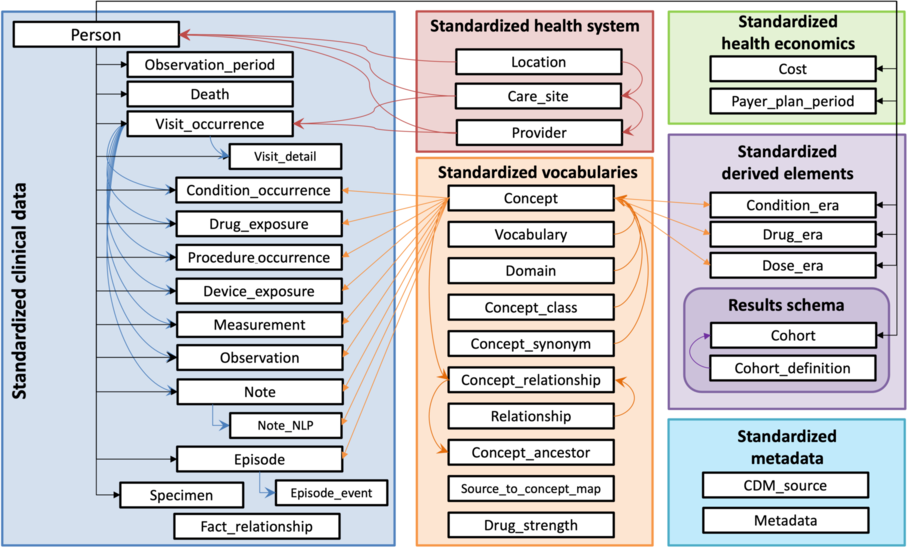
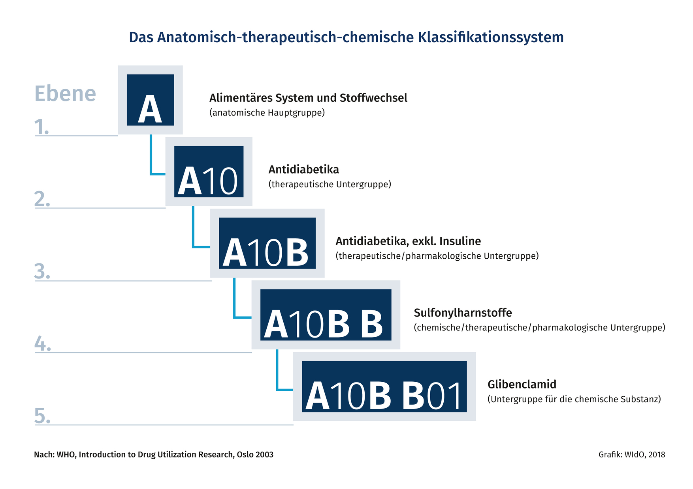
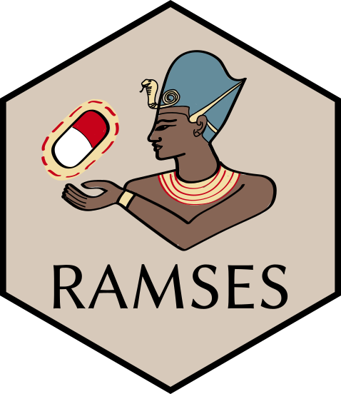

# Terms

# OMOP

{width=10%, fig-align="center"}

The Observational Medical Outcomes Partnership  is a public-private partnership that aims to improve the quality of observational research. OMOP provides a <span style="color:lightgreen;font-weight:bold">standardized data model </span>and common data elements to facilitate the sharing and analysis of healthcare data across different organizations.

# OMOP

OMOP's <span style="color:lightgreen;font-weight:bold">Common Data Model</span> (CDM) is an open community data standard, designed to standardize the structure and content of observational data and to enable efficient analyses that can produce reliable evidence.

# OMOP
{fig-align="center"}

# DDD
Defined Daily Dose is <span style="color:lightgreen;font-weight:bold">a unit of measurement</span> used to <span style="color:lightblue;font-weight:bold">quantify the amount of a drug that is typically prescribed for a specific condition</span>. It is often used in pharmacology and healthcare research to standardize the measurement of drug consumption.

# DDD
It is defined by the World Health Organization (WHO) and is based on the average maintenance dose of a drug for its main indication in adults. It allows for comparisons of drug usage across different populations and settings.

# ATC
Anatomical Therapeutic Chemical  is a <span style="color:lightgreen;font-weight:bold">classification system</span>, the active substances are divided into different groups according to the organ or system on which they act and their therapeutic, pharmacological and chemical properties. Drugs are classified in groups at five different levels

# ATC
{fig-align="center"}

# Problem

```{dot}
digraph D {
  OMOP -> ATC;
  ATC -> DDD;
}
```


# Solution ?

# Enter RAMSES
{fig-align="center"}

# RAMSES {auto-animate=true data-menu-title="RAMSES (i)"}

```R
compute_DDDs(ATC_code, ATC_administration, dose, unit, silent = FALSE)
```
# RAMSES {auto-animate=true data-menu-title="RAMSES (ii)"}

```R
 - ATC_code,
 - ATC_administration,
 - dose,
 - unit
```


# ATC code
```{dot}
digraph G {
    rankdir=BT;
    "RxNorm: Clinical Drug" -> "RxNorm: Ingredient";
    "RxNorm: Ingredient" -> "ATC 5th";
    "ATC 5th" -> "ATC 4th";
    "ATC 4th" -> "ATC 3rd";
    "ATC 3rd" -> "ATC 2nd";
    "ATC 2nd" -> "ATC 1st";
}
```


# ATC code
```{dot}
digraph G {
    rankdir=BT;
    label="RxNorm to ATC";
    "OMOP809928" -> "L01BE01"; # actually B A
    "OMOP809928" -> "L04AX03";
    "OMOP2603855" -> "L01BE01"; # actually B A
    "OMOP2603855" -> "L04AX03";
}
```


# Dose
- Haloperidol 0.5mg
- Haloperidol 1mg/ml

# Dose {auto-animate=true data-menu-title="Dose (ii)"}

```R
amount_value
amount_unit_concept_id
```

# Dose {auto-animate=true data-menu-title="Dose (iii)"}

```R
amount_value
amount_unit_concept_id
numerator_value
numerator_unit_concept_id
denominator_value
denominator_unit_concept_id
```

# drugsatc
- DuckDB
- R package
- ATC to DDD mapping
- DDD calculation

# drugsatc
https://github.com/SAFEHR-data/drugsatc
