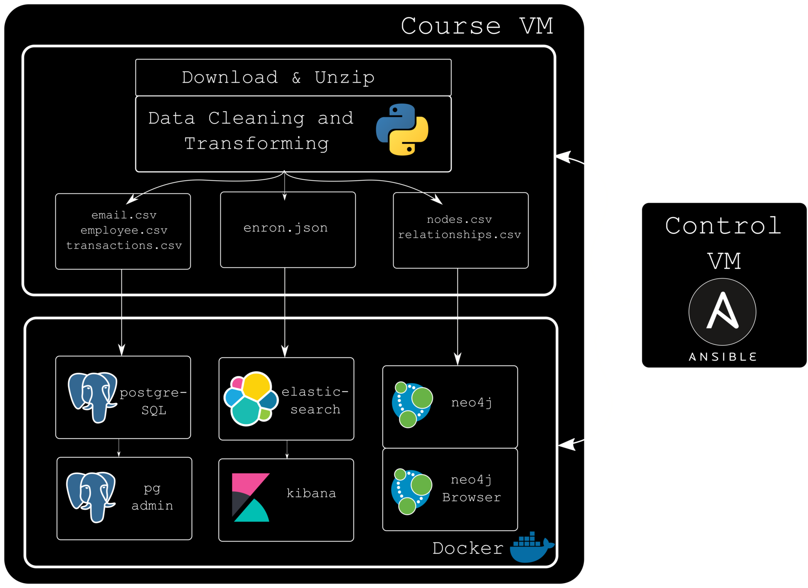

# Problem
SECTION ONE

## I need a course
- Accessible to digital humanities
- About databases
- Easy to setup


## Resources
- Database servers
- Python
- Bash ?
- Docker / Compose ?

# Solution
SECTION TWO

## It was covid


[{width=30%}](https://www.jeffgeerling.com/about)

I started watching Jeff Geerling's videos on [YouTube](https://www.youtube.com/@JeffGeerling).


## Ansible
- Open source
- Easy to use
- Taught by Jeff Geerling
    - [Ansible for DevOps](https://www.ansiblefordevops.com/)

# Design
SECTION THREE


## Start with a story
- Enron Email dataset
- Different perspectives
- Split the task


## Workflow

{width=60%}


## Setup sequence
```
01_install_docker.yml
02_get_data.yml
03_build_database.yml
```

## Utils

```
04_rebuild_elastisearch.yml
05_rebuild_neo4j.yml
99_delete_processed_data.yml
99_stop_containers.yml
```


# Mistakes
SECTION FOUR

## Testing
- I didn't know about molecule

## Documentation
- I didn't document the process

## Efficiency
- Python scripts are not great
